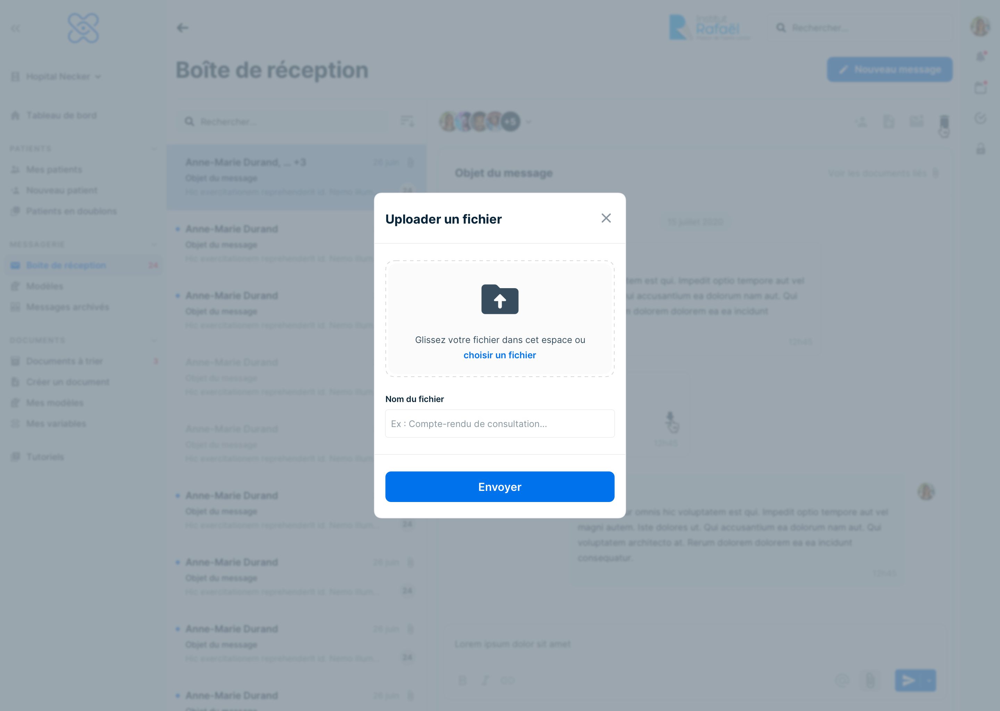

# Welcome to Instamed styleguide

It's a list of react components make with atomic design pattern.
Solution base on [React](https://reactjs.org/), [typescript](https://www.typescriptlang.org/), [tailwind](https://tailwindcss.com/), [i18next](https://react.i18next.com/), [storybook](https://storybook.js.org/) and [jest](https://jestjs.io/)

## Installation

```bash
npm ci
npm start ## to launch locally
npm build ## then ./storybook-static will be your site
```

## tests

### unit test

```bash
npm test
```

### linters

```bash
npm run lint
npm run tsc # typescript validation
```

### launch all (before commit)

```bash
npm run validate
```

### File structure
All the elements are stored inside the `ui` folder. This project is following the Atomic design structure.
More information about it : https://bradfrost.com/blog/post/atomic-web-design/

The following folders are available 
* `atoms` : It contains the list of atoms elements. An atom is a basic bloc element. Ex, button, icons, labels... Atoms are reusable anywhere inside the application
* `molecules` : A molecules is a group of atoms bonded together, it contains multiple atoms and is also reusable. Example, inputGroup, Notification item, Menu item, Modals
* `organisms` : An organism is a big chuck of molecules to. Ex, a complex page header, a form, a payment row
*  `templates` : A template, or page, is the full page


### Exercise
The goal of this test is the following : 
* Check if you are at ease with Typescript and a Storybook environment
* Check if you are at ease with the splitting of components that is part of React Core
* Check if you are at ease with Jest and the unit testing tools

The goal of this exercice is to create the following modal element and integrate it inside the styleguide :


You will create the following components :
#### ModalHeader
Create a `ModalHeader` molecule containing a title and a close button. This component will have the following props&nbsp;: 
  * `title` : The title of the modal
  * `onClose` : The action on close 

For this component, you will use the `H2` atom as well as the `Icon` atom 

#### Modal
Create a `Modal` molecule taking the following properties : 
* `children` : The content of the modal
* `title` : The title of the modal, it will be sent to the `ModalHeader` child
* `onClose` : The action on close, it will be sent to the `ModalHeader` child

For this component, you will use the `ModalHeader` atom, the `Separator` atom as well as the `Overlay` atom

#### Dropzone
Create a `Dropzone` molecule taking the following properties :
* `onUpload`: Called once a drop is done or on click on the `Link` component 
* `title` : The title of the dropzone. A default title "Glissez votre fichier dans cet espace ou" will be set **using translation file**
* `link` : The title of the dropzone. A default link "choisir un fichier" will be set **using translation file**

For this component, you will use the `Icon` atom as well as the `P` atom and `Link` atom


### UploadModal
Create a `UploadModal` organism taking the following properties :
* `onDrop`: Called once a drop is done
* `onSubmit` : Called once the `Envoyer` button is sent

For this component, you will use the `Modal` molecule, the `Dropzone` molecule as well as the `Input` atom, and the `Button` atom

Please try to follow the template as much as you can.
If you can set unit tests using snapshot, it's a bonus point. You can see how it is been done on other components
